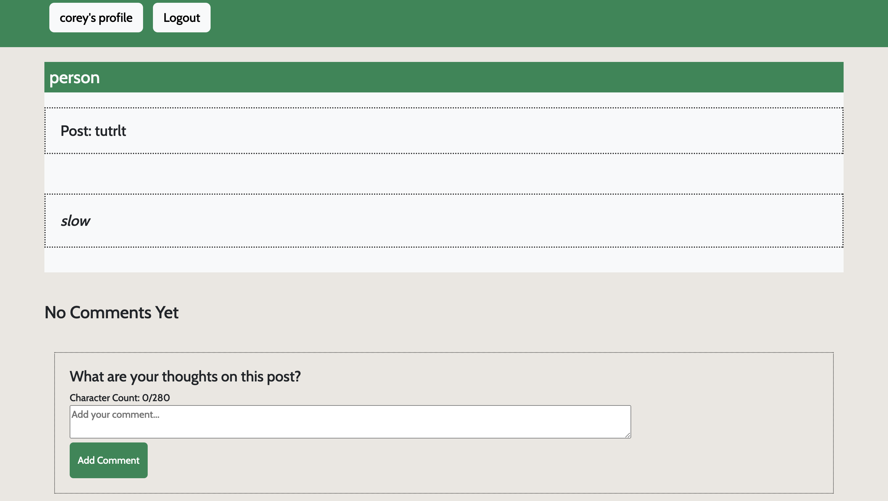

# Pets
A webpage all about pets and what people love about them

## Table of Contents
- [Description](#Description)
- [Installation](#Installation)
- [Usage](#Usage)
- [Features](#Features)
- [ScreenShot](#Screenshot)
- [Contributions](#Contributions)
- [Credits](#Credits)
- [License](#License)

## Description
We created this project because we love pets and wanted a page where people could express their love for pets. This webpage allows users to make a post about a pet and have others be able to share what they think about that pet as well. It's also great for questions people may have about their pet that someone could answer for them.

## Installation

N/A

## Usage

Simply visit our webpage: https://fierce-mesa-50144-4eb86e829931.herokuapp.com/  
It can be used to signup/login.  
Once you are logged in you can create a new post in the field and then click "add post".  
On another persons post you can click on the "join discussion" button which will take you to the comment section where you can leave a comment on that post.  

## Features

Our webpage includes a signup/login so that you can have an account.

Has a post section so that you can post about your pets for others to see. You can view others posts and join a discussion allowing you to leave a comment on that post.

## Screenshot

### Home

### Post

### Profile

### Comment

### Comment Page

## Contributions
 Louis - https://github.com/Lokistarwind  
 Elaine - https://github.com/elainefmartinez  
 Sam - https://github.com/artorrias  
 Corey - https://github.com/gulledgecorey  

 ## Credits

 The University of Minnesota bootcamp, we took a lot of inspiration from week 21-MERN Activity 26 with the setup of our webpage especially the components, queries, mutations and pages.

 Our TA Emma who helped and guided us in the right direction every class. She helped a lot with bugs and making sure our definitions were matching from the backend to the front.

 Our Instructor Charlie who helped a lot as well especially with getting our posts to work and having them display on the page. 

 ## License
This application uses license MIT
   
